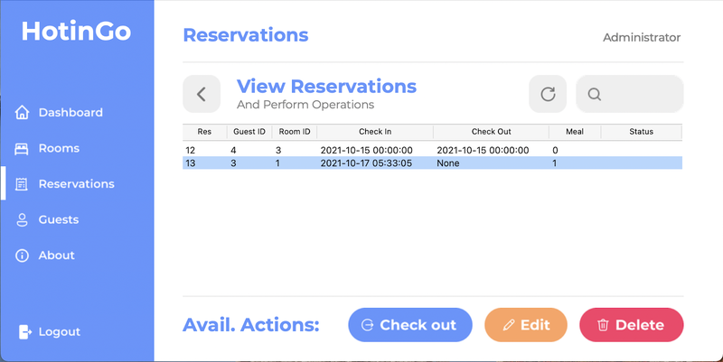

# 🏨 SmartHotel — Умная админ-панель для управления гостиницей

> **Интегрируем PMS с AI-ассистентом на базе GigaChat**

[](LICENSE.txt)
[](https://www.python.org/)
[](https://github.com/VyacheslavChernikov/SmartHotel)

---

## 📌 Описание

**SmartHotel** — это десктопное приложение на Python (Tkinter) для административного управления гостиницей. Проект разрабатывается как **универсальный адаптер**, который позволит подключить любую PMS (Property Management System) к **AI-ассистенту на базе GigaChat**.

На данный момент реализованы:
- Авторизация
- Панель управления (Dashboard)
- Управление гостями (добавление, просмотр, редактирование)
- Управление номерами (добавление, просмотр, редактирование)
- Управление бронированиями (добавление, просмотр, редактирование)
- Интеграция с MySQL

В планах:
✅ Русификация интерфейса  
✅ Создание REST API для интеграции с GigaChat  
✅ Подключение к проекту [ecopms-ai](https://github.com/VyacheslavChernikov/ecopms-ai)

---

## 🖼 Скриншоты

| Логин | Главная панель |
|-------|----------------|
|  |  |

| Добавить бронирование | Просмотреть бронирования |
|------------------------|---------------------------|
|  |  |

---

## ⚙️ Установка и запуск

### 1. Клонируйте репозиторий

```bash
git clone https://github.com/VyacheslavChernikov/SmartHotel.git
cd SmartHotel

2. Создайте виртуальное окружение и установите зависимости

python3 -m venv venv
source venv/bin/activate  # Linux/Mac
# venv\Scripts\activate   # Windows

pip install -r requirements.txt

3. Настройте базу данных
Импортируйте sql/hms.sql в вашу MySQL базу.
Заполните .env.example и переименуйте в .env.
4. Запустите приложение
python main.py

🌐 Интеграция с GigaChat (в разработке)
Для подключения к AI-ассистенту планируется добавить REST API на FastAPI. Это позволит:

Получать данные о гостях, номерах и бронированиях
Отправлять команды: «забронировать номер», «найти гостя по имени» и т.д.
Общаться с GigaChat через единый интерфейс
